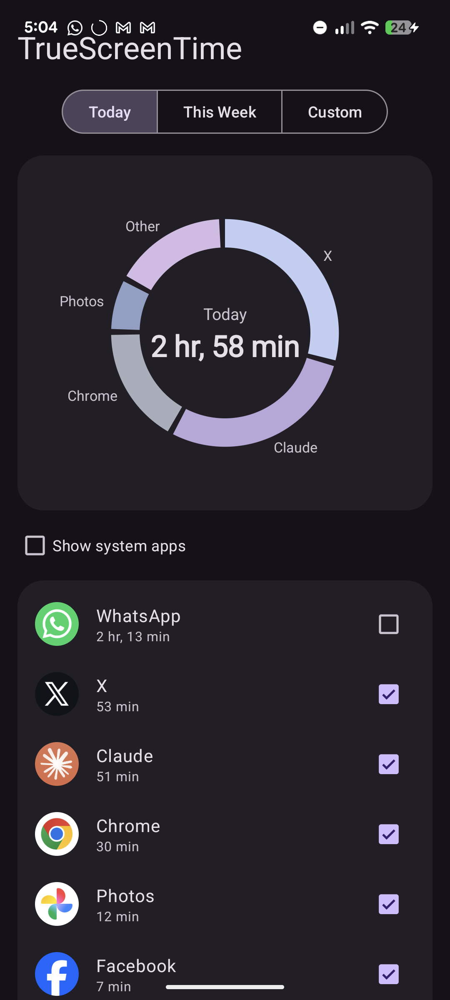

# TrueScreenTime

A minimal Android app (Kotlin + XML layouts, no Compose) that reads device
usage statistics and lets you build a **custom screen time total** by
including/excluding individual apps.

## Screenshots



*Today view — Digital-Wellbeing-style donut with the filtered total in the
center. Unchecking an app (here WhatsApp) removes it from the chart and the
total instantly. "This Week" switches to a weekly bar chart with a tappable
day selector.*

## Features

- **Accurate foreground time** — reconstructed from `UsageEvents`
  (`MOVE_TO_FOREGROUND` / `MOVE_TO_BACKGROUND` / `ACTIVITY_STOPPED`) rather
  than the pre-bucketed `queryUsageStats()` totals.
- **Wellbeing-style charts** — a donut chart of your included apps with the
  filtered total in the center (Today/Custom), and a weekly bar chart with
  hour gridlines and a tappable day selector (This Week). Both are small
  custom `View`s — no chart library.
- **Date ranges** — Today, This Week (Monday-based), or a custom start/end
  date picked from calendar dialogs.
- **Filterable app list** — every app with usage in the range is listed with
  its icon, name, and time, sorted descending. A checkbox on each row
  includes/excludes it from the big total, which updates live.
- **Persistent filters** — inclusion choices and the "show system apps"
  toggle are stored in `SharedPreferences`.
- **System app toggle** — system apps and the launcher are hidden by default
  to reduce clutter.
- **Usage access flow** — if `PACKAGE_USAGE_STATS` isn't granted, the app
  shows an explanation and a **Grant Access** button that deep-links to
  `Settings.ACTION_USAGE_ACCESS_SETTINGS`.

## Building

Requirements: JDK 17+ and an Android SDK (compileSdk 35). Setting up from
scratch on WSL2? See [BUILDING.md](BUILDING.md) for the exact commands.

```bash
./gradlew assembleDebug
# output: app/build/outputs/apk/debug/app-debug.apk
```

Or grab the debug APK from the [Releases](../../releases) page — it is built
by the GitHub Actions workflow in `.github/workflows/build.yml`.

## Install

```bash
adb install app/build/outputs/apk/debug/app-debug.apk
```

Then open the app and tap **Grant Access** to enable Usage Access.

- minSdk 24 (Android 7.0), targetSdk/compileSdk 35 (Android 15)
- Dependencies: AndroidX core/appcompat/recyclerview/lifecycle, Material
  Components, Kotlin coroutines — nothing else.
