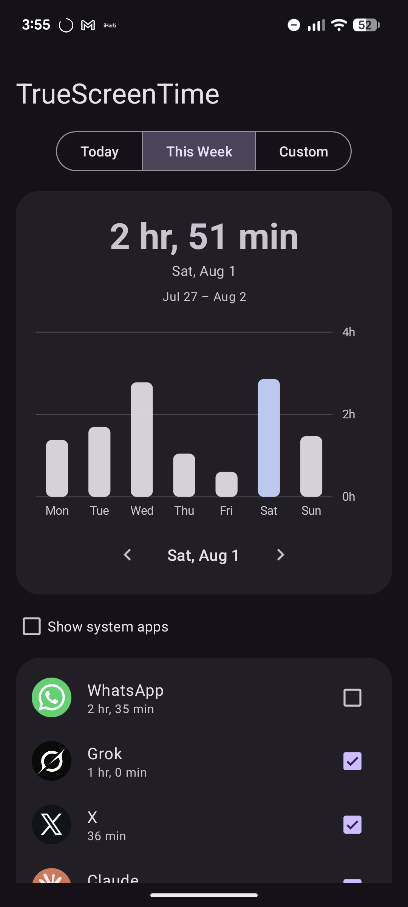
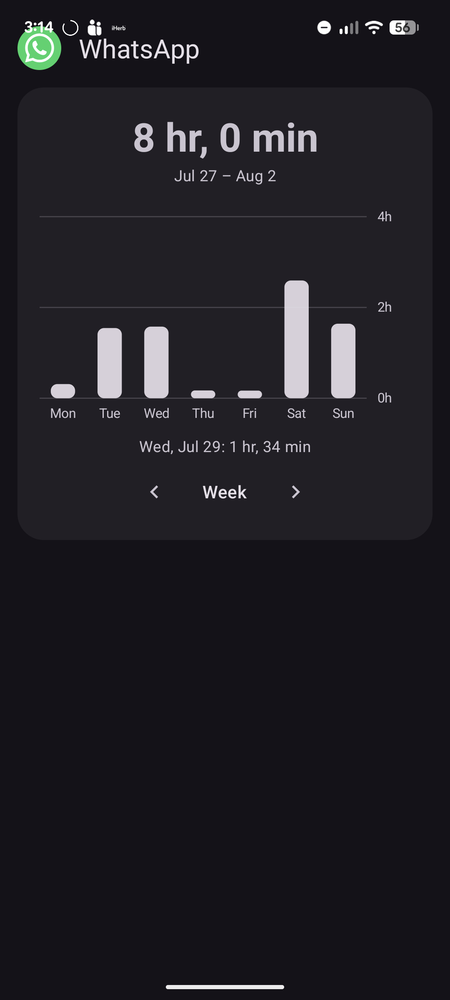
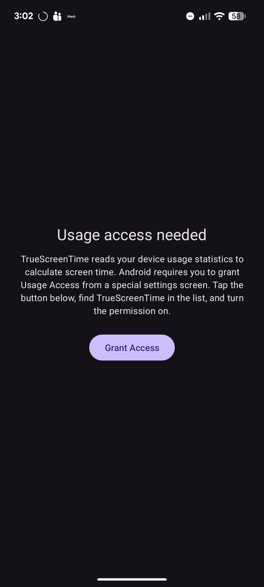
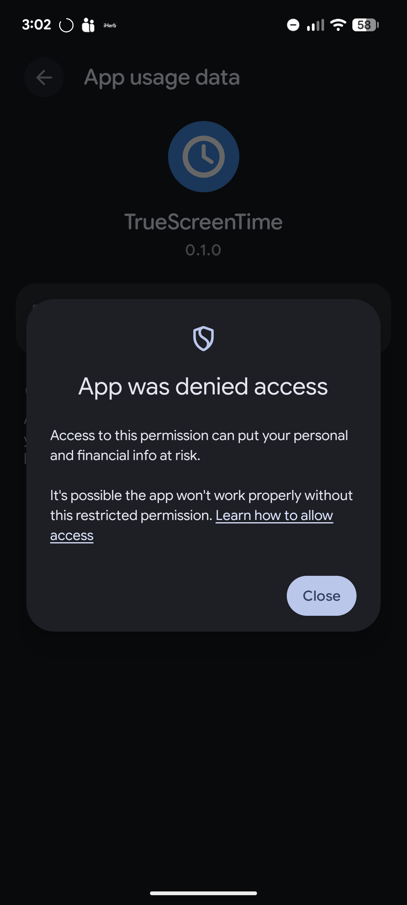
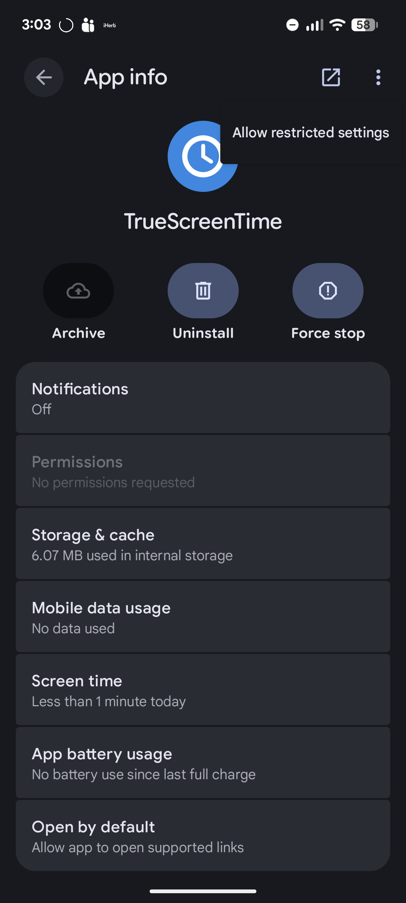
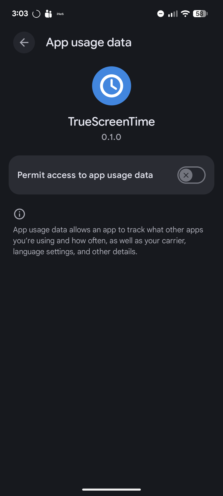

# TrueScreenTime

A minimal Android app (Kotlin + XML layouts, no Compose) that reads device
usage statistics and lets you build a **custom screen time total** by
including/excluding individual apps.

## Screenshots

| Today view | This Week | Per-app weekly detail |
|---|---|---|
|  |  |  |

*Left: Digital-Wellbeing-style donut with the filtered total in the center —
unchecking an app removes it from the chart and total instantly. Middle:
This Week shows a day-by-day bar chart; tap a bar (or use the chevrons,
which roll into neighbouring weeks) to see that day's donut and app list.
Right: tap any app's icon for its own weekly chart, with chevrons stepping
a week at a time.*

## Features

- **Accurate foreground time** — reconstructed from `UsageEvents`
  (`MOVE_TO_FOREGROUND` / `MOVE_TO_BACKGROUND` / `ACTIVITY_STOPPED`) rather
  than the pre-bucketed `queryUsageStats()` totals.
- **Wellbeing-style charts** — a donut chart of your included apps with the
  filtered total in the center (Today/Custom), and a weekly bar chart with
  hour gridlines and a tappable day selector (This Week). Both are small
  custom `View`s — no chart library.
- **Date ranges** — Today, This Week (Monday-based), or a custom start/end
  date picked from calendar dialogs.
- **Filterable app list** — every app with usage in the range is listed with
  its icon, name, and time, sorted descending. A checkbox on each row
  includes/excludes it from the big total, which updates live.
- **Exclusion list** — unchecking an app hides it from the list and leaves
  it out of the total. A dedicated **Excluded** screen lists everything you
  have excluded so you can restore apps individually or all at once, and a
  "Show excluded apps" toggle brings them back inline.
- **Persistent filters** — inclusion choices and the "show system apps" /
  "show excluded apps" toggles are stored in `SharedPreferences`.
- **System app toggle** — system apps and the launcher are hidden by default
  to reduce clutter.
- **Usage access flow** — if `PACKAGE_USAGE_STATS` isn't granted, the app
  shows an explanation and a **Grant Access** button that deep-links to
  `Settings.ACTION_USAGE_ACCESS_SETTINGS`.

## Building

Requirements: JDK 17+ and an Android SDK (compileSdk 35). Setting up from
scratch on WSL2? See [BUILDING.md](BUILDING.md) for the exact commands.

```bash
./gradlew assembleDebug
# output: app/build/outputs/apk/debug/app-debug.apk
```

Or grab the debug APK from the [Releases](../../releases) page — it is built
by the GitHub Actions workflow in `.github/workflows/build.yml`.

## Install

```bash
adb install app/build/outputs/apk/debug/app-debug.apk
```

Then open the app and tap **Grant Access** to enable Usage Access.

## Granting Usage Access (sideloaded apps on Android 13+)

Because the app is sideloaded, Android gates Usage Access behind
"restricted settings" and the first attempt is denied. The full flow:

| 1. Tap Grant Access | 2. First attempt is denied | 3. Allow restricted settings | 4. Turn the toggle on |
|---|---|---|---|
|  |  |  |  |

Step by step:

1. Open TrueScreenTime and tap **Grant Access** — it deep-links to the
   Usage Access settings, but the toggle is blocked at first ("App was
   denied access").
2. Go to **Settings → Apps → TrueScreenTime**, open the **⋮** overflow
   menu in the top-right, and tap **Allow restricted settings**
   (you may be asked to authenticate).
3. Return to the app, tap **Grant Access** again, and enable
   **Permit access to app usage data**.

The grant is remembered until the app is uninstalled. The app never
leaves the device with this data — everything stays local.

- minSdk 24 (Android 7.0), targetSdk/compileSdk 35 (Android 15)
- Dependencies: AndroidX core/appcompat/recyclerview/lifecycle, Material
  Components, Kotlin coroutines — nothing else.
